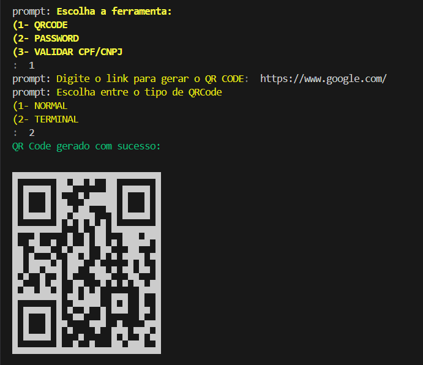

# Gerador de QRcode para e-commerce

<table>
        <tr>
            <td>
                
            </td>
            <td>
   <b> 📌 Sobre o Projeto</b>
   <p>
Este projeto foi desenvolvido como um kit de utilidades para e-commerces. Ele possui ferramentas práticas para o dia a dia de uma loja online e foi construído de forma modular e escalável, permitindo a adição de novas funcionalidades de maneira simples.
</p>
     </td>
        </tr>
    </table>

Atualmente, o projeto conta com:
- **Gerador de QR Code**  
- **Gerador de Senhas Seguras**  
- **Validador de CPFs e CNPJs**  

## Funcionalidades
✔️ Gerar QR Codes para links de produtos, campanhas ou integrações.
✔️ Criar senhas seguras utilizando caracteres personalizados.
✔️ Validar CPFs e CNPJs para cadastros de clientes e fornecedores.
✔️ Estrutura preparada para adicionar novas ferramentas no futuro.

## 🛠️ Tecnologias Utilizadas  
- [Node.js](https://nodejs.org/)  
- [Chalk](https://www.npmjs.com/package/chalk) – estilização de mensagens no terminal  
- [Prompt](https://www.npmjs.com/package/prompt) – captura de entradas do usuário  
- [QRCode Terminal](https://www.npmjs.com/package/qrcode-terminal) – geração de QR Codes no terminal  
- [cpf-cnpj-validator](https://www.npmjs.com/package/cpf-cnpj-validator) – validação de documentos  

## ⚙️ Como Executar  

1. **Pré-requisito:** Certifique-se de ter o **[Node.js](https://nodejs.org/)** na versão `v20.18.0` ou superior instalado.  

2. **Clone o repositório**  
   ```bash
   git clone https://github.com/Jezebel1990/qrcode.git
  ```

3. Acesse a pasta do projeto:
```bash
cd qrcode
```

4. Instale as dependências
```bash
npm install
```

5. Configure o arquivo .env (use o .env.example como base)


6. Execute o projeto:
```bash
npm run start
```


Feito com ♥ por [Jezebel Guedes](https://www.linkedin.com/in/jezebel-guedes/) 👋 Entre em contato!